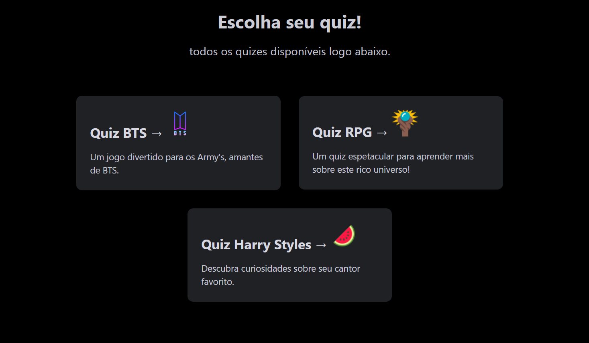

	
	<h1>Escolha do seu quiz</h1>

## :dart: Objetivo

Cria uma página que proporciona você escolher todos os conteúdos que produzi ao longo do meu aprendizado na programação
## :hammer_and_wrench: Ferramentas

-   [Nextjs](https://nextjs.org/)
-   [Styled Components](https://styled-components.com)
-   [Styled Icons](https://styled-icons.js.org/)
-   [Vercel](https://vercel.com)
-   [Yarn](https://yarnpkg.com/)

## Autor 

### |Matheus Santos|

## :eyeglasses: Demo em produção

[Link de acesso :dizzy:](https://select-quiz.vercel.app/)